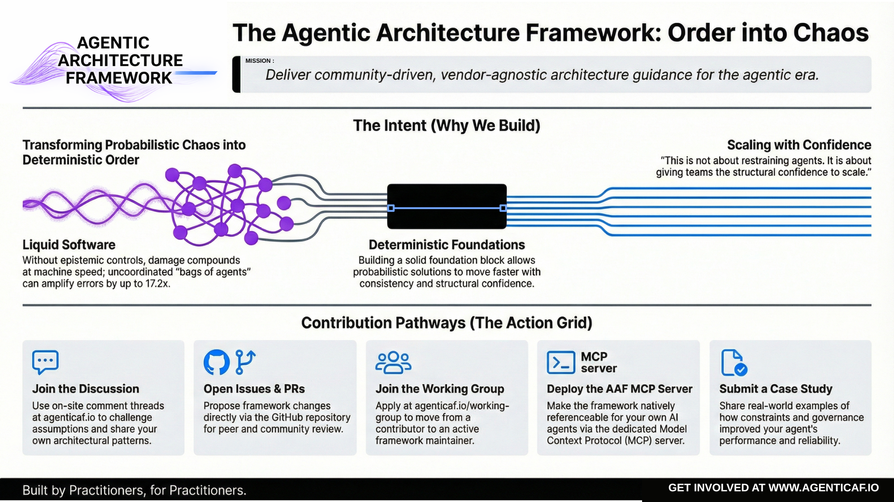

## Executive Summary

(A governance-first architecture for agentic systems)

### **Why this white paper exists**

Agentic AI is crossing the threshold from experimentation to operational infrastructure. The moment an AI system can take initiative, call tools, and operate over time, it stops being “a model that produces text” and becomes a probabilistic control system embedded inside real environments—email, calendars, codebases, CRMs, payment systems, production deployments.

That shift changes the dominant failure mode.

Most high-impact failures in AI systems do not happen because the model is probabilistic. They happen because probabilistic outputs are treated as deterministic truth—and are allowed to cross the line into actions, permissions, and decisions without sufficient validation. That is a systems design failure.

This paper documents the Agentic Architecture Framework: a practical method for building agentic systems that are safe, reliable, economically bounded, operationally observable, and scalable.

The framework is informed by direct experience building startups in the AI governance and optimisation space. That work surfaced a consistent reality across teams shipping agents: capability is not the bottleneck; governance and architecture discipline are. Without explicit controls, cost becomes unbounded, security boundaries collapse, and reliability degrades in ways teams cannot reproduce or explain.

### **Core definition: what an agent is (in practical terms)**

An agent is a software system that uses an LLM to pursue an outcome by executing a control loop:

Trigger → Interpret Context → Decide → Act → Observe Results → Verify → [Adapt / Stop]

This is why agentic systems must be engineered differently from single-turn LLM apps:

* they are stateful (context + memory),

* tool-using (actuation),

* iterative (loops compound cost and risk), and

* increasingly interoperable (agents and tools coordinate across systems).

**Note 1 :** This framework applies to AI systems broadly, but is optimized for agentic systems (persistent + tool-using + outcome-seeking). Where guidance is general AI-systems architecture, I try to explicitly tie it back to agentic control loops.  
**Note 2 :** Throughout this paper the agentic control loop is sometimes simplified to Trigger → Decide → Act → Verify. Separately, observability and tracing sections use the pattern intent → plan → act → verify to describe the audit trail that should be captured — this is the observability trace, not the control loop itself.

### **The central idea: the architecture of epistemic gates**

The central architectural concept in this paper is the architecture of epistemic gates.

An epistemic gate is the boundary where AI output transitions from:

* a candidate (draft/hypothesis/plan)

* an authoritative input (a belief, decision, or action)

A well-architected agentic system separates three phases:

* **Generation:** The model produces candidates: plans, drafts, hypotheses, tool arguments.

* **Validation:** Truth and constraints are reintroduced via mechanisms the model does not control:

  - deterministic checks (schemas, assertions, policies)

  - grounded sources (databases, verified APIs, retrieved evidence)

  - human approval where risk is high

* **Authority:** A defined actor (human, policy engine, supervisory gate) converts validated output into an action or decision.

**The rule is simple:** epistemic gates must scale with risk.

Low-stakes tasks can tolerate lighter validation. High-stakes tasks require strong, unavoidable gates.

This is the difference between “an agent that is impressive” and “an agent that is operable.”This paper defines epistemic gates formally in Section 2.5 and uses them as a recurring design lens across all pillars.

### **What the framework provides**

The Agentic Architecture Framework applies six “well-architected” pillars (adapted from cloud disciplines) to agentic AI systems, and adds two cross-cutting foundations that are uniquely decisive in the agentic world.

#### **The six pillars**

1. Security. Architecture to diligently constrain agency and reduce impact. Assume the reasoning layer can be influenced and prevent that influence from becoming unsafe action.  
   **Core themes:** tool safety, least privilege, write-action gating, secrets handling, boundary controls, prompt injection as a system risk.

2. Reliability. Define success as a verifiable end state, not a plausible narrative. Engineer for repeatability under rate limits, tool failures, and environmental variability.  
    **Core themes:** definitions of done, deterministic verification, idempotency, fallbacks, evaluation harnesses.

3. Cost Optimization.  Treat autonomy as a budgeted resource. Without budgets, loop-based systems are cost volatility by design.

**Core themes:** model routing (planner vs executor), token discipline, tool-call budgets, caching, early stopping.

4. Operational Excellence. Operate agents as living production systems: observable, evaluable, versioned, and rollback-able.

**Core themes:** observability traces (intent → plan → act → verify), continuous evals, skill/tool supply chain, release discipline.

5. Performance Efficiency. Choose topology based on task structure, not hype. Multi-agent architectures can introduce coordination overhead and error amplification if not governed.  
    **Core themes:** orchestration patterns, latency vs throughput trade-offs, minimizing tool round trips and context churn.

6. Sustainability. Make compute impact visible and govern it as a shared resource. In scaled agent systems, efficiency is sustainability.

**Core themes:** measurement, waste reduction (tokens/loops), scheduling, workload shaping.

#### **The two cross-cutting foundations**

1. Context Optimization (Horizontal Foundation) Context is the substrate of autonomy. Engineer it deliberately:  
   - separate task context from durable memory

   - budget context like a resource

   - retrieve and ground instead of stuffing

   - tag provenance (trusted policy vs untrusted data)

   - normalize tool outputs before re-injecting them

2. Autonomy & Outcome Governance. (Horizontal Foundation) Autonomy must be explicit, bounded, and verified:  
   - define autonomy levels (assistive → delegated → bounded autonomous → supervisory)

   - enforce budgets (steps/tools/tokens/time/spend)

   - define “done” in testable terms

   - escalate on uncertainty and high-risk actions

   - gate authority through validation

These two foundations are what make the framework specifically agentic rather than a generic AI systems checklist.

**How to use the framework**

The framework is designed for three practical uses:

1. **Design method:** Use it to specify autonomy level, tool permissions, budgets, definitions of done, context policy, and gating model before you build.  
2. **Architecture review method:** Use it as a structured pre-production review across pillars (security, reliability, cost, ops, performance, sustainability) and foundations (context, autonomy/outcomes).  
3. **Maturity model for increasing autonomy:** Start with assistive systems, move to delegated execution, then bounded autonomy, then supervisory orchestration—only as verification, observability, and governance become robust.

### **Key takeaways (the “if you remember nothing else” list)**

* Agents are systems, not prompts. Treat them as production software with governance requirements.

* Probabilistic reasoning cannot be trusted as authority. Epistemic gates must exist and must scale with risk.

* Autonomy without budgets is cost volatility by design. Budgets are governance, not finance.

* Reliability means verified end states, not plausible narratives. “Definition of Done” is an architectural primitive.

* Context is the substrate of autonomy—and a major risk surface. Separate memory from context and govern provenance.

* Interoperability will increase (tools, agents, protocols). Governance must sit above the protocol layer.

**Executive Summary Citations (Sources & Links)**

* AWS Well-Architected pillars (baseline pillar model):  
  https://docs.aws.amazon.com/wellarchitected/latest/framework/the-pillars-of-the-framework.html

* UK NCSC on prompt injection as a system risk (impact-reduction framing):  
   https://www.ncsc.gov.uk/blog-post/prompt-injection-is-not-sql-injection

* OWASP GenAI “Excessive Agency” (autonomy as a vulnerability class):  
   https://genai.owasp.org/llmrisk2023-24/llm08-excessive-agency/

* Anthropic on evaluating agents by final environment state (outcome vs transcript):  
   https://www.anthropic.com/engineering/demystifying-evals-for-ai-agents

* ReliabilityBench (agent reliability as consistency/robustness/fault tolerance):  
   https://arxiv.org/abs/2601.06112

* Google research on scaling agent systems (topology trade-offs and error amplification):  
  https://research.google/blog/towards-a-science-of-scaling-agent-systems-when-and-why-agent-systems-work/

* NIST AI RMF (systematic validation and risk management framing):  
   https://nvlpubs.nist.gov/nistpubs/ai/nist.ai.100-1.pdf

**Document Map**  
This white paper is structured in four layers:

* Sections 1–3: Definitions and system mental models (what agents are; deterministic vs probabilistic vs agentic).  
* Section 4: The framework overview and how to use it.  
* Sections 5–10: The six architectural pillars (Security, Reliability, Cost, Operations, Performance, Sustainability).  
* Sections 11–12: Two cross-cutting foundations (Context Optimization; Autonomy & Outcome Governance).  
* Sections 13–15: Ecosystem interoperability, application method, and conclusion.