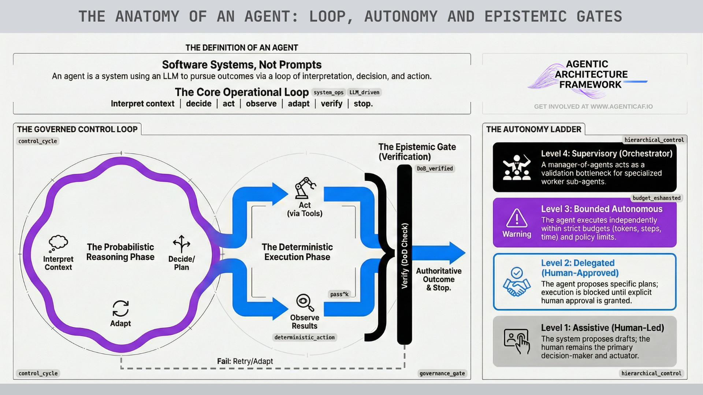

## 

# **What Is an Agent?**

(Foundational definition, scope, and the architecture of epistemic gates)

This paper is intentionally strict on definitions. “Agent” is now used to describe everything from a prompt template to an autonomous system that can take actions across production infrastructure. If we don’t define terms precisely, the architecture guidance that follows becomes either too generic to be useful or too narrow to be applicable.

This section establishes:

1. A working definition of an agent,

2. What makes a system meaningfully agentic,

3. What agents are not,

4. degrees of agency (autonomy is a spectrum), and

5. A critical concept that sits underneath safe agent design: the architecture of epistemic gates.

### **2.1 A Working Definition of an Agent**

A practical, engineering-first definition is:

An agent is a software system that uses an AI model to pursue a desired outcome by executing a loop of: interpret context → decide → take action (often via tools) → observe results → adapt until done.

This definition makes three things explicit:

* Agents are outcome-driven, not response-driven.

* Agents operate over time (multi-step loops rather than single-shot inference).

* Agents take or recommend actions, often by calling tools that affect external systems.

This aligns closely with the way major model providers and the broader ecosystem describe agents. OpenAI’s guidance frames agents as systems built from models plus tools, instructions, and guardrails, and it distinguishes “single-agent systems” from “multi-agent systems” based on how that loop is orchestrated. 

Anthropic’s engineering work is similarly explicit that “agentic” behavior is fundamentally about an LLM (or an AI model type) using tools in a loop rather than acting as a static text generator. 

The architectural consequence is straightforward: if a system has no loop, no tool use, and no persistence, then it may still be a valuable LLM application—but it is not meaningfully agentic.

### **2.2 What Makes a System “Agentic” (Not Just “AI”)**

Many systems use LLMs / models. The distinguishing feature of agentic systems is not model choice; it is agency, the system’s ability to progress a task toward completion with partial autonomy.

A system becomes meaningfully agentic when it exhibits most of the following properties:

**1\) Persistence over time:** Agents maintain state/context across steps (and often across sessions). This introduces lifecycle concerns: recovery, replay, drift, and governance.

**2\)** **A observe–decide–act-verify loop:** Agentic behavior is iterative. The agent plans, acts, observes the environment, and adapts. The ReAct paradigm is a canonical formulation of this loop: it interweaves reasoning with actions that retrieve information or change state, improving grounding and reducing hallucination and error propagation. 

**3\) Tool use/actuation:** Tool invocation is the practical line where “AI output” becomes “system behavior.” Tools may query systems, modify records, deploy code, trigger workflows, send messages, or create long-lived artifacts. Once a system can act, it inherits many of the same requirements we associate with automation platforms and distributed systems and our team members. It is also useful to consider this tool use in the same lens as a human using the same tool, identity and access management disciplines are just as applicable to agents as they are to humans. 

**4\) Initiative under constraints:** Agents can decide the next step without requiring the user to specify each intermediate instruction. However, autonomy is not binary; it must be designed, bounded, and governed.

**5\) Outcome orientation and verification:** Agentic systems should be judged by whether they achieve outcomes—not whether they produce plausible text. This framing is reinforced in reliability and evaluation literature for agents, which increasingly emphasizes end-state correctness rather than transcript resemblance. 

These properties are precisely why “agentic architecture” is not just a rebrand of AI architecture. The system surface area expands from model prompting to include: tool governance, state management, monitoring, validation, and explicit outcome control.

### **2.3 What Agents Are Not (Common Misclassifications)**

This section exists to prevent predictable failure modes that come from over-applying the “agent” label.

A prompt template is not an agent.

If it is request → response with no loop, no tool use, and no persistence, it may be a good LLM application, but it is not an agent under this definition.

A deterministic workflow with an LLM step is not automatically an agent.

If the process is fully specified and executes deterministically (even if an LLM is used for classification or summarization), it is fundamentally a workflow system. That can be exactly the right choice.

Self-reflection is not multi-agent.

Multi-agent implies multiple loci of decision-making coordinating via messages or orchestration. Self-critique loops can improve quality, but they are not the same as multi-agent collaboration patterns.

### **2.4 Degrees of Agency (Assistive → Delegated → Autonomous → Supervisory)**

Most “agent failures” in practice are autonomy failures. Teams unknowingly grant too much autonomy without corresponding validation and governance.

 

A practical taxonomy that maps directly to architecture controls:

**1\)  Assistive (Human-led)**

* The system drafts, summarizes, analyses, and recommends.

* A human triggers actions and remains the accountable decision-maker.

* Lowest operational risk; easiest adoption path.

2) **Delegated (Human-approved execution)**

* The agent proposes plans and actions.

* Execution requires explicit approval (e.g., preview → approve → execute).

* Strong fit for early production deployments and regulated environments.

**3\) Autonomous (Bounded autonomy)**

* The agent executes actions within explicit budgets (steps, tools, spend, time) and policy gates.

* Humans intervene by exception.

* Requires strong outcome verification, observability, rollback, and incident handling.

**4\) Supervisory / Orchestrator (Manager-of-agents)**

* A supervisor agent coordinates specialist agents, constrains their actions, and validates outputs before downstream execution.

* This topology matters: research on scaling agent systems shows that centralized orchestration can reduce error amplification compared to unconstrained independent agents by functioning as a validation bottleneck. 

This autonomy spectrum is foundational to the framework. Many controls (security, reliability, cost, operations) scale with the level of autonomy being granted.

### **2.5 The Architecture of Epistemic Gates (Why Probabilistic Output Becomes “Authority”)**

To build agents safely, we need to explicitly model a core risk: probabilistic outputs are frequently interpreted by humans as deterministic answers. Unless the system is designed to prevent it, probability quietly becomes authority.

This is the purpose of epistemic gates:

*An epistemic gate is the point where an AI output stops being a possibility and becomes something the system (or a human) treats as knowledge, decision, or action.*

A well-architected agentic system separates three stages:

**1\) Generation**

The model produces drafts, options, classifications, plans, or hypotheses. At this stage, outputs should be treated as candidates, not truth.

**2\) Validation**

Truth and rules are reintroduced through mechanisms the model does not control:

* deterministic checks (schemas, tests, policy rules)

* grounding against external sources (databases, retrieval, verified APIs)

* human review where necessary

This principle aligns with risk-management frameworks that emphasize test, evaluation, verification, and validation (TEVV) as core lifecycle requirements for trustworthy AI systems. 

**3\) Authority**

Authority defines who or what is allowed to convert validated outputs into decisions or actions. If “authority” is implicitly granted to the model (“because the AI said so”), the epistemic boundary has collapsed.

The key design rule is:

*Epistemic gates must scale with risk.*  
*Low-stakes use can tolerate lighter validation gates.*   
       *High-stakes use requires strong, unavoidable gates and explicit accountability.*

This concept is not philosophical; it is architectural. It directly shapes how we design: approval workflows, policy gates, outcome verification, escalation thresholds, and the separation of probabilistic reasoning from deterministic execution.

### **2.6 Why These Definitions Matter for the Agentic Architecture Framework**

The Agentic Architecture Framework is not a set of generic best practices. It is a direct response to the properties defined above:

* Because agents act and can be influenced, we need security architecture that constrains input channels and tool use.

* Because agents operate across steps and dependencies, we need reliability centered on outcomes, not narratives.

* Because autonomy can amplify spend, we need cost optimization driven by context optimisation, budgets and model routing.

* Because agents evolve and operate continuously, we need operational excellence: observability, evaluation, controlled change.

* Because orchestration choices matter, we need performance efficiency and topology-aware design.

* Because usage scales, we need sustainability and efficiency discipline.

* Because autonomy depends on what the system “knows,” we need context optimization as a cross-cutting foundation.

* Because probabilistic outputs become action, we need epistemic gates, and we need autonomy/outcome governance running horizontally across the framework.

In short: once you define an agent as a persistent, outcome-seeking, tool-using system, the architecture requirements in the following sections become non-optional.

**2.7 Working Glossary (Terms used consistently in this paper)**

* **Tool:** A callable capability that interacts with an external system (read or write).

* **Skill:** A packaged, versioned capability built on tools plus instructions, constraints, and validation checks.

* **Workflow:** A deterministic or semi-deterministic sequence of steps with predefined control logic. Could be triggered by a skill. 

* **Agent loop:** The iterative control cycle where an agent plans, acts via tools, observes results, and adapts.

* **Context:** Task-scoped information supplied to the model for a specific step.

* Memory: Durable state retained across tasks (must be higher-signal and governed).

* **Policy gate:** A permission/authorization decision point (e.g., “allowed to call this tool?”).

* **Validation gate:** A correctness check against truth/constraints (e.g., schema checks, tests, evidence checks).

* **Epistemic gate:** The boundary where an output transitions from candidate → validated → authoritative decision/action.

## **Section 2 Citations (Sources & Links)**

1. OpenAI: A practical guide to building agents (PDF)

   https://cdn.openai.com/business-guides-and-resources/a-practical-guide-to-building-agents.pdf 

2. OpenAI: A practical guide to building AI agents (web)

   https://openai.com/business/guides-and-resources/a-practical-guide-to-building-ai-agents/ 

3. Anthropic: Effective context engineering for AI agents

   https://www.anthropic.com/engineering/effective-context-engineering-for-ai-agents 

4. Yao et al. — ReAct: Synergizing Reasoning and Acting in Language Models (arXiv abstract)  
   https://arxiv.org/abs/2210.03629 

5. Google Research: ReAct blog

   https://research.google/blog/react-synergizing-reasoning-and-acting-in-language-models/ 

6. NIST: AI Risk Management Framework (AI RMF 1.0) (TEVV emphasis)  
    https://nvlpubs.nist.gov/nistpubs/ai/nist.ai.100-1.pdf 

7. NIST: Generative AI Profile (NIST AI 600-1) (additional oversight and documentation for GAI; human review/oversight framing)

   https://nvlpubs.nist.gov/nistpubs/ai/NIST.AI.600-1.pdf 
